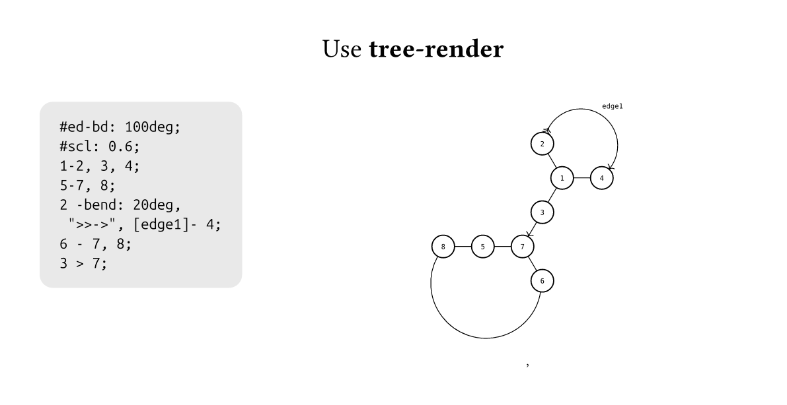
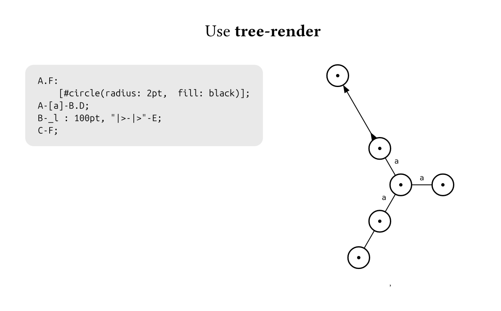
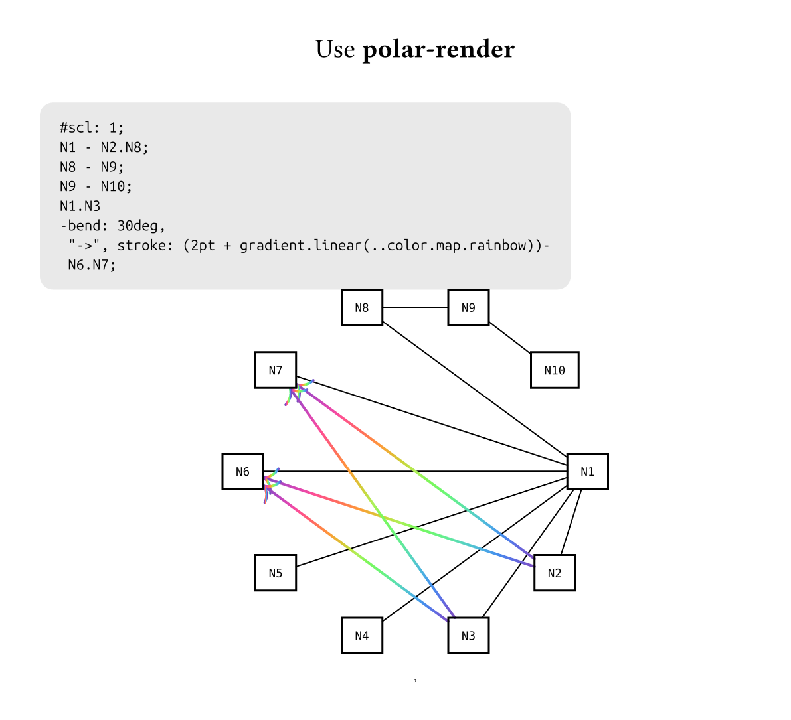

# H-Graph

H-Graph 是一个基于 [Typst](https://typst.app/) 的简洁图描述语言, 可以解析信息作为节点和边, 以及一些渲染的参数. 同时自带一个渲染后端, 使用[fletcher](https://typst.app/universe/package/fletcher)
它让你用极简的 DSL 描述图的 **节点、边、内容**，并且支持 **自定义渲染器** 来灵活布置位置.

## ✨ 特性

* 简单直观的语法：`A - B;` 就是一条边, 无需提前声明(当然可以提前声明).
* 范围与展开：`A.Z;` 自动生成一组节点`A,B,C...Z`, `A.C - A1-B12`.就是左右两两都连线.
* 宏替换：`|...|`中的内容作为宏, 系统内置下划线开头的编译展开的宏, 渲染器也可以自定义渲染时展开的宏. 如`A: [hello, i am $|_name|$];`, `|_name|`被替换为这个节点名字， 结合名称展开可实现自定义的个性化显示
* 元信息控制：自环、多重边的是否启用
* 自定义渲染：提供 `polar-render`（极坐标环形）与 `tree-render`（树状布局）, 你也可以只用语言解析器,然后自定义渲染器.

---
## 🚀 快速上手

### 1.利用`raw`替换:
```typst

#import ...

#show raw.where(lang: "graph"): enable-graph-in-raw(polar-render)
// or #show raw.where(lang: "graph"): enable-graph-in-raw(tree-render)
```graph
#scl: 0.8;
1-2, 3, 4;
5-6, 7, 8;
2- 3, 4;
6 - 7, 8;
3 > 7;
4- 8;
```
```

### 2. 更灵活的使用
```typst
// first parse the code and get info
#let infos = h-graph-parser("A.C; B-A;")
// use render to display
#let (nodes, edges, render_args) = infos
#tree-render(
  ..render_args,
)(nodes: nodes, edges: edges)

// 或者更加简单
#h-graph("A.C; B-A;", tree-render)
```
---
## 📷 示例







---
## ⚙️ 语言规则

`h-graph`语言的基本单元是语句, 每个语句都强制用分号隔开.
在`h-graph`语言里面, 除了内容声明语句外, 无法使用`";", ":", "-", ","`, 请使用其他符号.
`h-graph`的运行流程是:
```
解析h-graph语言生成节点边和元信息(编译时) --> 传入render渲染(渲染时)
```

### 1. 节点的名称单元

```h-graph
A; 
B; 
A.C, 1.10, Node;
```
两个名字中间如果用`.`连接会被自动展开, 展开是字母和数字一一对应的展开.
如`1.10`, `A.C`就是`1,2,3...10`, `A,B,C`， `A1.A3`就是`A1, A2, A3`.

范围展开， 单个名称等等可以用逗号隔开， 共同组成 **名称单元**.
名称单元可以独立成句, 相当于没有边的节点.

### 2.边
语句[边声明],
利用`-`, `>`, `-`, `-...-`作为中缀连接两个**名称单元**即声明了边.
```
A.C - A.C;
1,2, 10.20 - A;
E > D;
D > A;
A < C;
A - bend: 30deg, "-|>" - D;
```
`-`是纯直线连接, `>` `<`分别带有从左到右的箭头和从右到左的箭头.
使用`-..-`可以声明边属性, 如果这个属性是`key:value`, 作为字典参数, 否则是数组参数.然后在渲染的时候传入`fletcher`的`edge`作为参数, 可以查看fletcher手册看常用函数. 我们规定字典参数以`_`开头的作为私有参数, 会被渲染器拦截作为渲染器的参数来提供针对渲染器的渲染时.

`-..-`内部使用`,`和`:`需要转义: `\,`, `\:`.

`-..-`里提供两个宏, 在编译时替换, `|_from|`, `|_to|`, 分别表示当前边左侧和右侧的节点的名称.
如
```
A - bend: 30deg, "-|>", [|_from| -> |_to|'s' content is $a + b = c$] - D;
```
表示这个边有30deg的弯曲, 有箭头形状是`-|>`, 边上显示内容是这样的typst内容.

### 3.内容声明
一个节点渲染器一般默认显示他的名字, 除非他进行了内容声明.
语句[内容声明]首先输入名称单元, 然后`:`后面将会被无条件的解析为typst下的显示内容.
```
A.B, 1: [this is node];
```
内容声明语句支持宏`|_name|`, 表示当前内容节点的名称. 比如
```
A.Z: $|_name|$;
```
让这些节点的内容是数学模式显示他们的名称.

### 4.元信息
语句[元信息]提供解析运行时的自定义解析选项:
```
@noloop
```
* `@noloop;` 禁止自环
* `@multi-edge;` 允许多重边
* `----` 下方语句重置元信息

如
```
@noloop;
A-A;
```
将不会显示这个自选边.
```
@multi-edge;
A-B;
A-bend:30deg-B;
```
会显示两条边.
如果没有开启默认只会显示两个节点的第一个被声明的边.
`----;`会阻断上方的所有信息, 下方就是支持自环不支持重边的默认环境.
如图
```
@noloop;
----;
A-A;
```
还是会存在自环.


### 5.渲染参数
语句[渲染参数]提供在文本里自定义渲染时传入渲染函数的参数
* 用 `#key: value;` 来传递渲染参数，比如：
```typst
#cir_n: 3;
#scl: 0.8;
```
您永远只应该在利用`raw`环境写入的`h-graph`代码里使用, 因为这个时候你无法直接调用渲染器. 其他时候你可以先解析然后直接手动调用渲染器函数并且提供参数.
各种参数和渲染器相关.


## 🎨 渲染器

H-Graph 默认提供：

#### 以图的主干树展开布局
```
tree-render(
  scl: 1, // 缩放大小
  ed-bd: "30deg", // 不是主干上的边的默认弯曲弧度
  min-space: "50pt", // 每条边的默认距离
  base-deg: "0", // 整体的选转角度
)
```
这个函数同时支持一个边的自定义参数`_l`:
```h-graph
A-_l: 100pt-B;
```
意思是这条边的长度设为`100pt`, 方便解决一些重叠时候的问题.

#### 按同心圆分布
```
polar-render(
  cir_n: 1, // 同心圆参数
  scl: 1, // 缩放
)
```

你也可以写自己的渲染器：

```typst
#let my-render(scl: 1) = (nodes: dictionary, edges: array) => {
  scl = int(scl) // 如果是在代码里设定的参数, 参数是字符串,要统一一下
  diagram(
    ..nodes.keys().map((n, i) => node((i*20pt, 0), n, name: <n>)),
    // 我们推荐你使用render-help-draw-edge绘制边, 这个辅助函数可以自动解决传入edge的参数的冲突
    ..edges.map(ed => render-help-draw-edge(ed: ed)), 
  )
}
```

然后这样使用：

```typst
#h-graph("A...D; A - B;", my-render)
```

---

## 📌 TODO / 扩展

* [ ] 更多布局算法（force-directed 等）
* [ ] 节点样式支持
* [ ] 子图 / 分组

---